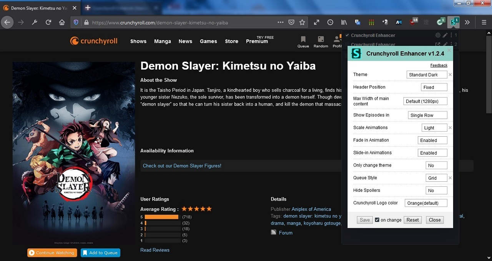

# Crunchyroll Enhancer

Enhance the UI of [Crunchyroll](https://www.crunchyroll.com).

[Click to see screenshots of other themes](./imgs/themes.md)

## Installation
1. Make sure that Stylus extension is installed. If not, then download for:- [Firefox](https://addons.mozilla.org/en-US/firefox/addon/styl-us/), [Chrome](https://chrome.google.com/webstore/detail/stylus/clngdbkpkpeebahjckkjfobafhncgmne).
2. [Click to install style](https://lazy-guy.github.io/crunchyroll-enhancer/crenhancer.user.css)

## Configuring Style
1. Open Crunchyroll.
2. Click on the Stylus icon in your browser's toolbar.
3. Click on the gear icon in front of the "Crunchyroll Enhancer".

## Available Customizations
- [Themes](./imgs/themes.md)
- Redesigned UI(Can be disabled by setting "Only Change theme" to "Yes")
- Header Position (Fixed or Normal)
- Animations
- Hide Spoilers
- Queue Style (List or Grid)
- Multiple Crunchyroll logo colors
